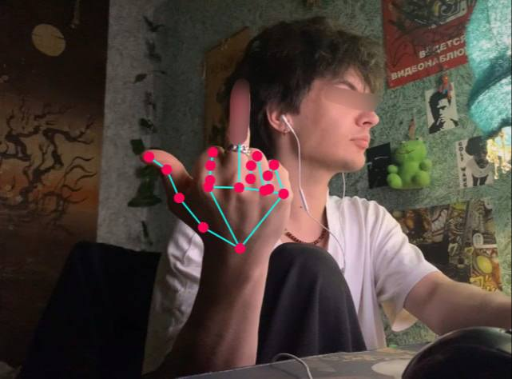

## CP-Gesture-Control

--

Интерактивный веб-проект, который в режиме реального времени отслеживает жесты рук с помощью камеры и позволяет управлять музыкой (громкостью, скоростью, паузой) или визуальными эффектами через разные режимы. //Есть скрытый жест для появления сердечек))

--

##Технологии

- HTML5 — структура страницы и разметка
- CSS3 (flexbox, анимации, стилизация) — стили и оформление киберпанковского интерфейса
- JavaScript (ES6+) — логика работы с камерой, обработка жестов, управление аудио и визуальными эффектами
- Mediapipe Hands (от Google) — нейросетевая библиотека для распознавания рук и отслеживания их ключевых точек
- Canvas API — отрисовка 2D-графики: костей рук, частиц, анимаций и эффектов
- Аудио HTML5 — воспроизведение и управление музыкальным треком

##  GitHub Pages:
[Открыть сайт](https://shak2o.github.io/CP-Gesture-Control/) 

---

## Как открыть

как запустить
склонировать репозиторий
открыть index.html в современном браузере (рекомендуется Chrome или Firefox)
разрешить доступ к камере
наслаждаться управлением музыкой и эффектами жестами рук!
--

##  Автор
Разработка и оформление — [shak2o (Денис)](https://github.com/shak2o)  
